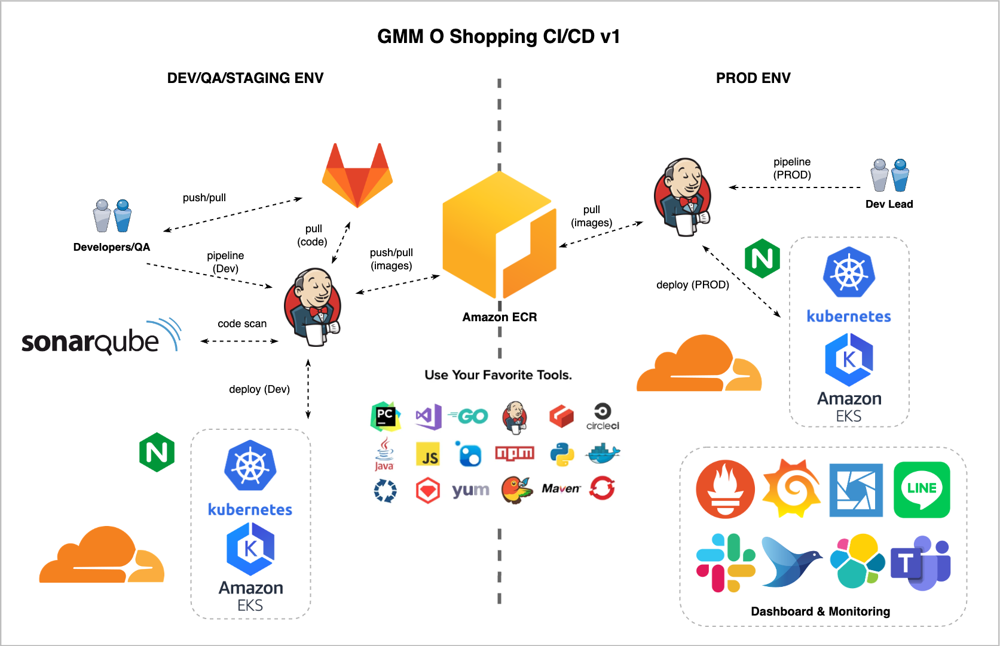

# Workshop Kubernetes (EKS) Demo App
GitHub/GitLab + Jenkins CI/CD Pipeline + k8s (EKS)

# GMM O Shopping CI/CD v1 Overview


# Prepair your computer
1.Install aws cli
https://docs.aws.amazon.com/cli/latest/userguide/getting-started-install.html

2.Install kubectl
https://kubernetes.io/docs/tasks/tools/

3.Insert aws credentials to ~/.aws/credentials
```
[gmmosp-nonprod]
aws_access_key_id=XXX
aws_secret_access_key=XXX
```

4.Update kubeconfig (~/.kube/config) with aws cli
```
aws eks update-kubeconfig --name gmmo-nonprod \
--region ap-southeast-1 \
--profile gmmosp-nonprod
```

5.Test 
```
kubectl get node
```

6.Install Lens (Options)
https://k8slens.dev/

- Open Lens add gmmo-nonprod cluster

# Agenda
- Overview k8s 
- What's k8s?
  - Open source container orchestration tool
  - Developed by Google
  - Help you manage containerized applications in different deployment ENV
- Why k8s?
- Who use k8s?
https://kubernetes.io/case-studies/
- Workshop 1 (Deploy k8s App with kubectl)
- Workshop 2 (Deploy k8s App with Jenkins CI/CD Pipeline)
- Q & A


# Workshop 1 (Deploy k8s App with kubectl)
- kubectl get all, ns, deployment, pod, service
- kubectl create ns
- kubectl create deployment
- kubectl expose deployment
- kubectl scale deployment
- kubectl delete service
- kubectl delete deployment
- kubectl delete ns

- Lens k8s Dashboard & Monitoring

Options (ถ้าเวลาเหลือ)
- k8s secret, configmaps
- k8s pv, pvc
- Grafana + Prometheus k8s Dashboard & Monitoring


# Labs
```
# Show Cluster Info
kubectl cluster-info

# Show Namespace
kubectl get ns

# Show Deployment
kubectl get deployments -n workshop

# Create Namespace
kubectl create ns workshop

# Create Deployment
kubectl create deployment [yourname]-web --image=nginx -n workshop

# Port Forward
kubectl port-forward [yourname]-web-xxx 8080:80 -n workshop

# Show Logs
kubectl logs -f [yourname]-web-xxx -n workshop

# Expose Service
kubectl expose deployment [yourname]-web --port=80 --target-port=80 -n workshop

# Create Ingress
cat <<EOF | kubectl apply -f -
apiVersion: networking.k8s.io/v1
kind: Ingress
metadata:
  name: [yourname]-web
  namespace: workshop
  annotations:
    kubernetes.io/ingress.class: nginx
spec:
  rules:
    - host: [yourname]-workshop.gmmo.tech
      http:
        paths:
          - path: /
            pathType: Prefix
            backend:
              service:
                name: [yourname]-web
                port:
                  number: 80
EOF

# Scale App
kubectl scale deployment/[yourname]-web --replicas=2 -n workshop

# Delete Ingress
kubectl delete ingress [yourname]-web -n workshop

# Delete Service
kubectl delete service [yourname-web] -n workshop

# Delete Deployment
kubectl delete deployment [yourname]-web -n workshop
```
 
# Workshop 2 (Deploy k8s App with Jenkins CI/CD Pipeline)
- Deploy k8s App with Jenkins CI/CD Pipeline
- Deploy k8s App in Dev ENV (build, tag, push, pull images)
- Deploy k8s App in QA ENV (from images tag)
- Auto Deploy from GitHub/GitLab Trigger to Jenkins

## [GitLab]
1. Create your repository https://gitlab.com/gmmo/workshop/[name-app]
2. Fork from https://github.com/pornpasok/k8s-workshop to your repository
3. Edit Jenkinsfile
- APP_GIT_URL = "https://gitlab.com/gmmo/workshop/[name-app]"
- APP_BRANCH = "main"
- APP_NAME = "[name-app]"
- DEV_PROJECT = "workshop"
- ECR_SERVER = "XXX.dkr.ecr.ap-southeast-1.amazonaws.com/workshop"

## [Jenkins]
https://cicd.gmmo.tech/

4. Create username-password (name)
5. Create Job under folder workshop with name DEV-[name-app]

## [ECR]
6. Create docker repository workshop/[name-app]

## [Lens]
7. Create secret [name-app] with credentials
- ELASTIC_APM_SERVICE_NAME = "[name-app]-workshop"
- ELASTIC_APM_SECRET_TOKEN = "XXX"
- ELASTIC_APM_SERVER_URL = "https://XXX.apm.us-central1.gcp.cloud.es.io:443" 

## [CloudFlare]
8. Create subdomain [name-app]-workshop.gmmo.tech

# Jenkins
https://cicd.gmmo.tech/
- u: -
- p: -

# Grafana Dashboard
https://grafana.gmmo.tech/
- u: -
- p: -

# ELK Stack
https://gmmo.kb.us-central1.gcp.cloud.es.io:9243/app/home
- u: -
- p: -

### Ref:
- Kubernetes Tutorial for Beginners [FULL COURSE in 4 Hours] https://www.youtube.com/watch?v=X48VuDVv0do
- DO280
https://www.redhat.com/en/services/training/do280-red-hat-openshift-administration-II-operating-production-kubernetes-cluster
- DO288
https://www.redhat.com/en/services/training/do288-red-hat-openshift-development-ii-containerizing-applications
